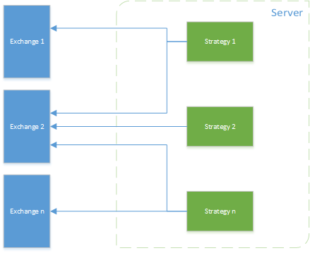
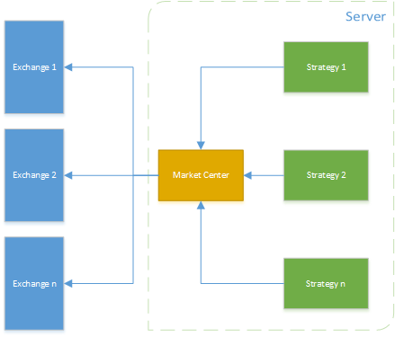

# Market Center
A center to collect market data from cryptocurrency exchanges and distribute it over UDS(Unix Domain Sockets) using [GoEx](https://github.com/nntaoli-project/GoEx)

## NOT Support Windows

## Why market center
Some exchanges has limitation for rest api, limit access frequency by IP or Account.

Usually we start some strategies in one server(description followed), Exchange 2 maybe ban your server IP because too many request.

So we could use a market center as a router to avoid limitation(description followed)

## Why UDS
### benchmark compare between USD and TCP/IP loopback

* When the server and client benchmark programs run on the same box, both the TCP/IP loopback and unix domain sockets can be used. Depending on the platform, unix domain sockets can achieve around 50% more throughput than the TCP/IP loopback (on Linux for instance). The default behavior of redis-benchmark is to use the TCP/IP loopback.[redis report](https://redis.io/topics/benchmarks)
* [Performance Analysis of Various Mechanisms
for Inter-process Communication
](http://osnet.cs.binghamton.edu/publications/TR-20070820.pdf)

## How UDS
* [unix-domain-sockets-in-go](https://eli.thegreenplace.net/2019/unix-domain-sockets-in-go/)

## APIs

* SubscribeTicker
* SubscribeDepth
* SubscribeTrade
* GetTicker
* GetDepth
* GetTrade

## Client

[https://github.com/goex-top/market_center_client](https://github.com/goex-top/market_center_client)
